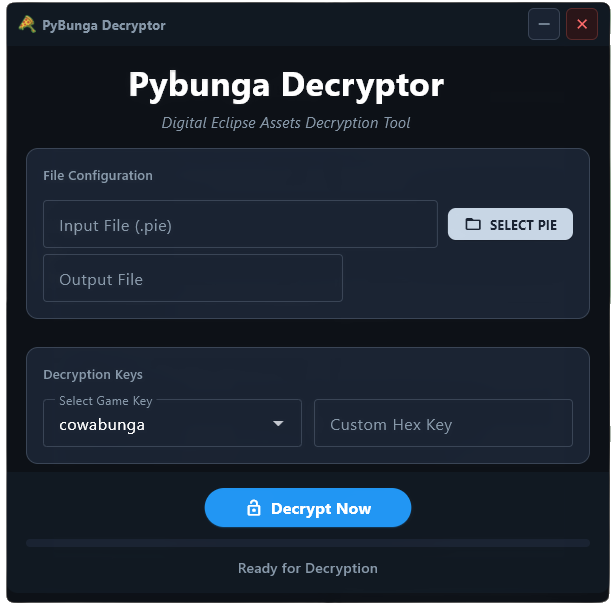

# 🐢 Pybunga Decryptor (Python Port)



A modern, cross-platform port of the Cowabunga decryption tool for Digital Eclipse assets. This version features a modular Python architecture with both a command-line interface (CLI) and a Material Design graphical user interface (GUI).

## ✨ Features

- **Material Design GUI**: Clean, modern interface built with [Flet](https://flet.dev/).
- **Efficient CLI**: Fast, terminal-based processing for power users.
- **Ported Logic**: Exact replication of the original Rust decryption algorithm.
- **Built-in Keys**: Pre-configured keys for a wide range of Digital Eclipse collections (Atari, Blizzard, Yu-Gi-Oh!, TMNT, etc.).
- **Progress Tracking**: Real-time feedback for large file decryptions.
- **ZIP Validation**: Automatically verifies if the output is a valid ZIP file.

## 🎮 Supported Games

The following games are supported with pre-defined keys:

- **Teenage Mutant Ninja Turtles: The Cowabunga Collection** (`cowabunga`)
- **Atari 50: The Anniversary Celebration** (+ DLCs) (`atari`, `atari-dlc1`, `atari-dlc2`, `atari-dlc3`)
- **The Making of Karateka** (`making-karateka`)
- **Garbage Pail Kids: Mad Mike and the Quest for Stale Gum** (`garbage-pail-kids`)
- **Llamasoft: The Jeff Minter Story** (`jeff-minter`)
- **Tetris Forever** (same key as `jeff-minter`)
- **Blizzard Arcade Collection** (specifically `music.pie`) (`blizzard-arcade`)
- **Mighty Morphin Power Rangers: Rita's Rewind** (`mighty-morphin`)
- **Yu-Gi-Oh! EARLY DAYS COLLECTION** (`yu-gi-oh`)
- **Mortal Kombat Legacy Collection** (`mortal-kombat-lc`)
- **Golden Tee Arcade Classics** (`golden-tee`)
- **Rayman: 30th Anniversary Edition** (`rayman30th`)

### 🔑 List of Possible Keys

- `cowabunga`
- `atari`
- `atari-dlc1`
- `atari-dlc2`
- `atari-dlc3`
- `making-karateka`
- `garbage-pail-kids`
- `jeff-minter`
- `blizzard-arcade`
- `mighty-morphin`
- `yu-gi-oh`
- `mortal-kombat-lc`
- `golden-tee`
- `rayman30th`

## 🚀 Quick Start

### 1. Prerequisites
- Python 3.9 or higher.

### 2. Setup
Clone the repository and navigate to the Python version folder:
```bash
cd cowabunga_python
python -m venv venv
# Windows
.\venv\Scripts\activate
# Linux/macOS
source venv/bin/activate

pip install flet
```

### 3. Running

#### Launch the GUI
Simply run the entry point without arguments:
```bash
python main.py
```

#### Use the CLI
Provide the input and output paths:
```bash
python main.py assets.pie assets.zip -k cowabunga
```

## 🛠️ CLI Options

| Argument | Description |
| :--- | :--- |
| `input` | Path to the `.pie` file to decrypt. |
| `output` | Path where the decrypted data will be saved. |
| `-k, --key` | Predefined game key (e.g., `atari`, `blizzard-arcade`). |
| `-c, --custom`| Custom 32-bit hex key (e.g., `0xC90CA066`). |

## 📂 Project Structure

- `main.py`: Dual-mode entry point (GUI/CLI).
- `cowabunga_ui.py`: Material Design interface code.
- `cowabunga_cli.py`: Command-line interface logic.
- `cowabunga_core.py`: Core decryption algorithm & file processing.

## 🤝 Credits

- **Original Tool**: [Cowabunga](https://github.com/Masquerade64/Cowabunga/tree/main) by [Masquerade64](https://github.com/Masquerade64/).
- **Ported by**: DohmBoy64bit

